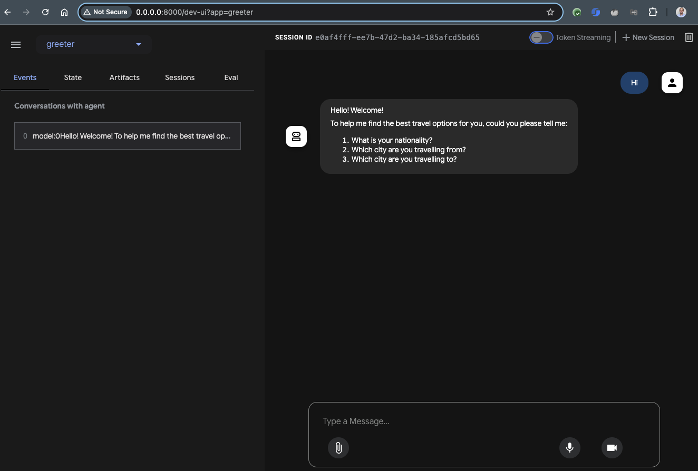

# Greeter Agent

## Introduction

This agent greets the traveler and gathers the necessary information about the upcoming trip such as the nationality of
the traveler, departure and arrival cities. 

Take a look at the [agent.py](agent.py) for details. It's the simplest agent you can have in ADT: an agent
that uses a model and some simple instructions. No tools or no sub-agents. 

> [!IMPORTANT]  
> Before you run your agent, make sure to follow the [setup](../../../setup.md) page
> and especially set an `.env` file at the root of your app: [travel_helper](../../../travel_helper).

There are multiple ways to interact with your first agent.

## Run agent - terminal

Outside the folder of the agent use `adk run`:

```shell
adk run ./greeter
```

You should be able to interact with your agent from the command line now:

```shell
Running agent greeter_agent, type exit to exit.
user: Hi
[greeter_agent]: Hello there! Welcome! To help me find the best travel options for you, could you please tell me:

1.  What is your nationality?
2.  Which city are you travelling from?
3.  Which city are you travelling to?

user: 
```

## Run agent - web

You can also launch the dev UI to interact with the agent.

Outside the folder of the agent use `adk web`:

```shell
adk web
```

Go to `http://0.0.0.0:8080`, choose your agent from the drop-down, and start chatting with your agent:



---

Congratulations, your first agent is done! Go back to [travel_helper](../../README.md) to continue building the rest of
the agents.